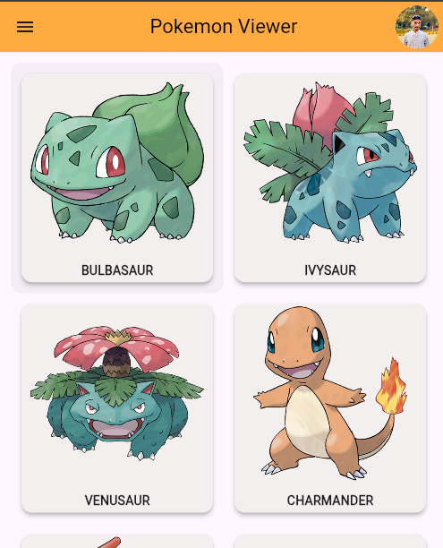
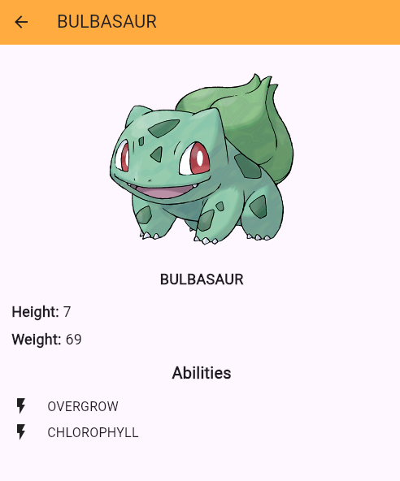

# 🐱‍👤 Pokémon Api Flutter App

## 📌 Overview

This is a Flutter-based mobile application that fetches data from a Pokémon API and displays a list of Pokémon along with detailed information for each item.

The project demonstrates API integration, state handling, and UI design and usage of hero animation in Flutter.

## 🚀 Features

* Fetch Pokémon data from REST API
* Display list of Pokémon
* Detail screen with Pokémon information
* Clean and responsive UI

## 🛠️ Tech Stack

* Flutter (Dart)
* REST API
* HTTP package

## 📸 Screenshots

## 🎯 Purpose

This project was built to practice API integration and navigation between screens in Flutter.

## 👨‍💻 Author

Saqlain
